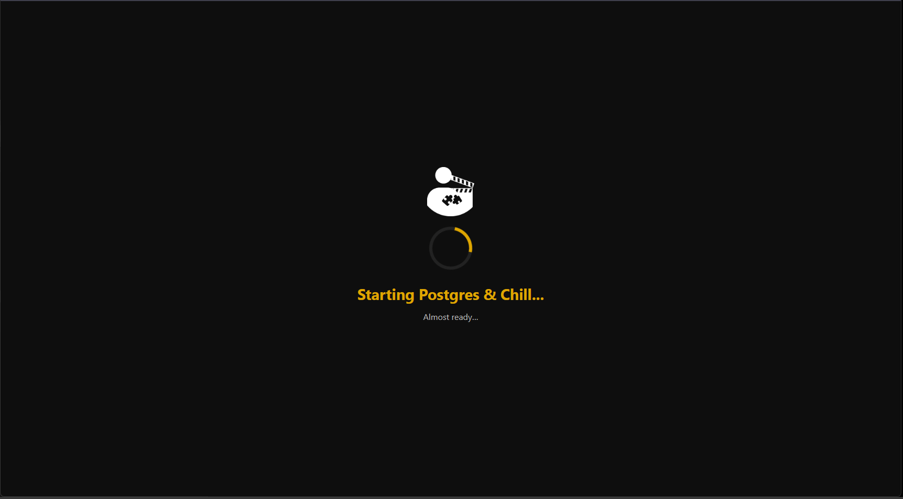
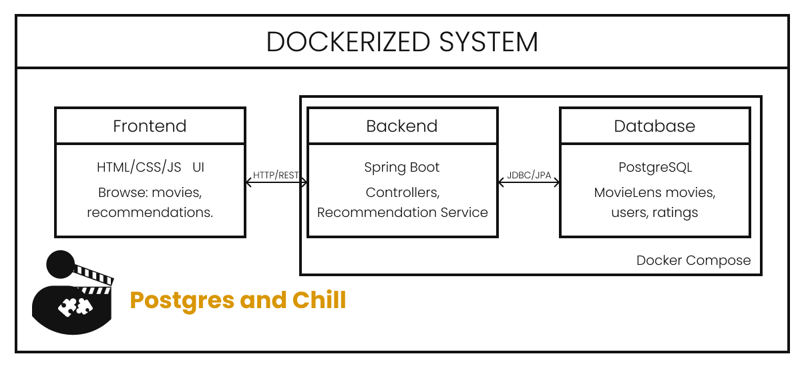
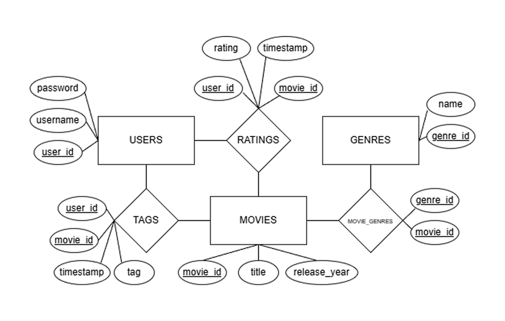
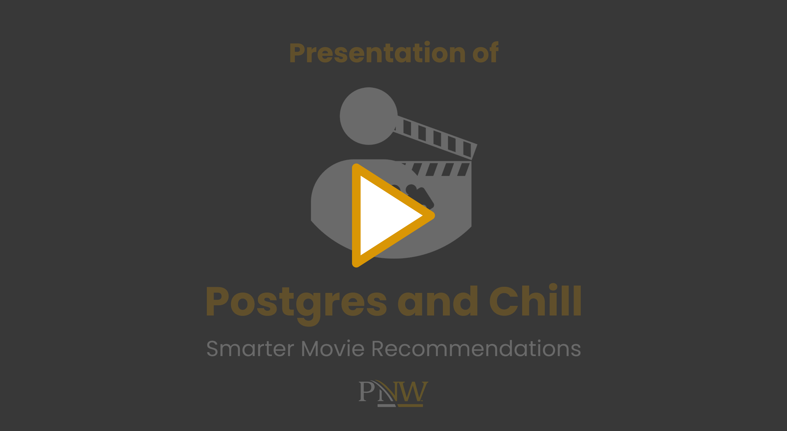
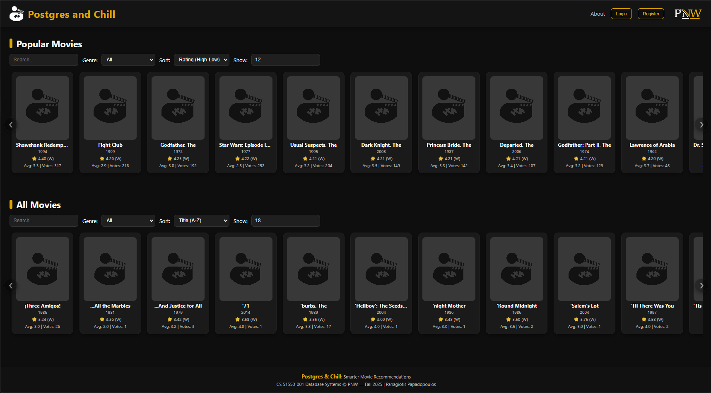
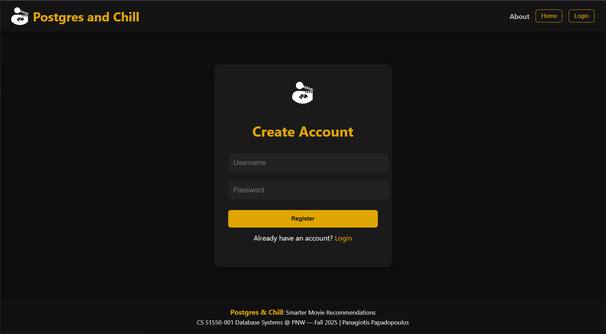
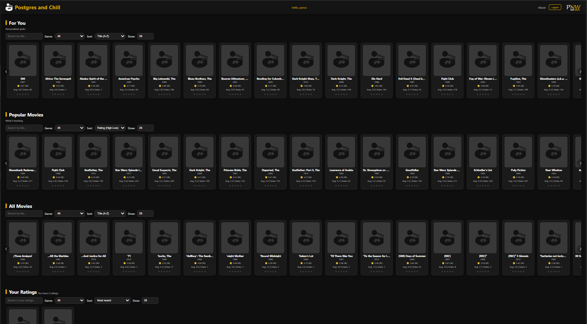
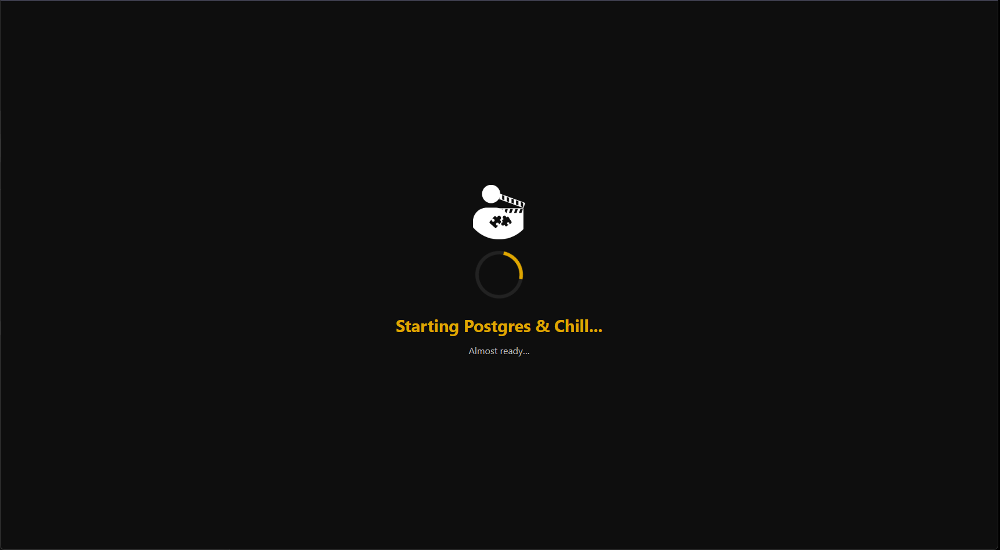
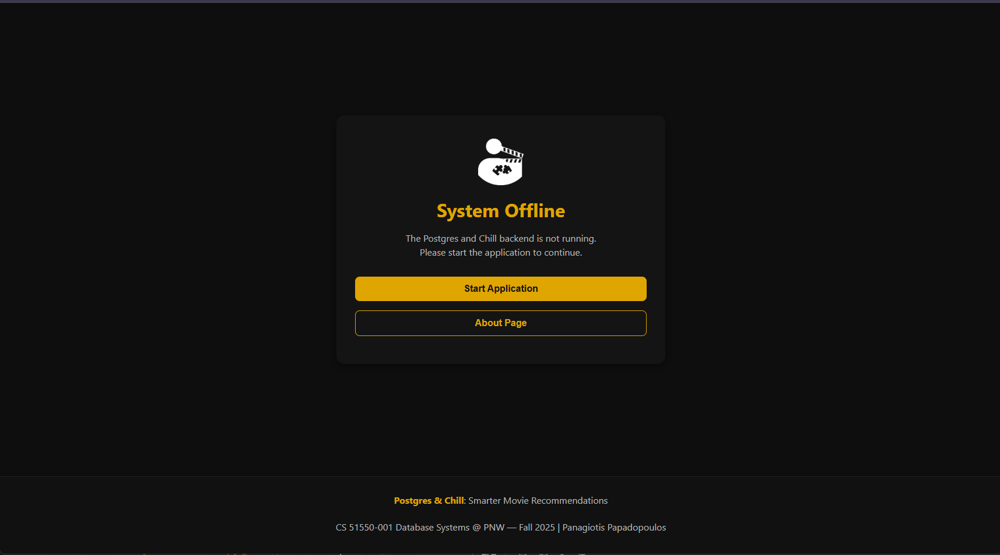

  

<h1 align="center">Postgres and Chill</h1>

<b>Smarter Movie Recommendations • Full-Stack • Dockerized</b>

  
  
  
  
  
  
  
  

---

# 🎬 Overview

**Postgres and Chill** is a fully Dockerized full-stack movie recommendation platform built as part of  
**CS 51550 — Database Systems, Purdue University Northwest (Fall 2025)**.

The application integrates:

- **PostgreSQL** for data storage  
- **Spring Boot REST API** backend  
- **Custom collaborative filtering recommendation engine**  
- **Static HTML/CSS/JS frontend (Netflix-inspired UI)**  
- **Docker Compose** for one-click deployment  

Users can:

- Browse *all* movies  
- View *popular* movies (Bayesian weighted ranking)  
- Receive *personalized recommendations*  
- Rate movies (0–5 stars)  
- Complete a *cold-start onboarding* experience  

---

# 📸 Demo & Screenshots

### 🎞 Demo GIF

  

# 🚀 Running the Application

## 1️⃣ Install Prerequisites
- Install **Docker Desktop**
- !!! Docker needs to be running !!!
## 2️⃣ Start the Entire App

start.bat

This will:

- Start the PostgreSQL container  
- Load MovieLens data  
- Start the Spring Boot backend  
- Open the frontend in your browser  

## 3️⃣ Stop the Application

stop.bat

## 4️⃣ Reset Database (Fresh Load)

cleanStart.bat

## 5️⃣ View Logs

console.bat
---

# 🧠 Features

### ⭐ Personalized Recommendations  
Collaborative filtering with weighted correlation & rating-based similarity.

### ⭐ Smart Popular Movies Ranking  
Weighted (Bayesian) IMDB-style formula:  weighted = (v/(v+m)) * R + (m/(v+m)) * C

Ensures fairness for movies with fewer ratings.

### ⭐ Movie Browsing  
- Popular  
- All movies  
- Genres  
- Sorting options  
- Average & weighted rating display

### ⭐ Cold Start Onboarding  
New users rate initial movies → system learns preferences.

### ⭐ Fully Dockerized  
Zero manual setup. One click → app runs.

---

# 🏛 System Architecture

  

---

# 🗄️ Database Schema

  

# 🧮 Recommendation Engine (How It Works)

### Step-by-Step Logic

1. Collect all ratings from the user  
2. Identify unrated movies  
3. Compute similarity between unrated and rated movies  
   - Weighted correlation  
4. Predict a score for each movie  
5. Rank movies → return **Top-N recommendations**

### Scoring Logic

- If predicted score > user average → “likely to enjoy”  
- If predicted score < user average → “likely to dislike”  

This mirrors classical collaborative filtering used by platforms like Netflix.

# 🧪 Results & Evaluation

- ✔ Fully functional end-to-end recommendation system  
- ✔ Accurate REST API behavior  
- ✔ Stable Docker deployment  
- ✔ Good recommendation quality  
- ✔ Clean UI and user flow  
- ✔ Achieved all goals from the project proposal  

# ⚠️ Limitations & Future Improvements

### Current Limitations
- No JWT authentication  
- Frontend not using React/Vue  
- Recommendation engine is classical, not ML-based  
- No pagination or infinite scroll  
- Tags table unused  

### Future Improvements
- Neural network–based recommender  
- React frontend  
- JWT security  
- Watchlists + favorites  
- Caching for faster queries  

# 📥 Download

This repository includes:

- Full source code  
- Project report (PDF)  
- Docker setup  
- Database schema + loaders  
- Screenshots & demo GIF  
- Presentation Video
- Demo Video
# 🎥 Project Videos

## 📘 Presentation Video

  

<b>▶ Click the thumbnail to watch the Presentation Video</b>

## 🛠️ Demo Video

  

<b>▶ Click the thumbnail to watch the Demo Video</b>

### UI Previews

   
  <i>Home Page — Popular & All Movies</i>  

   
  <i>Login</i>  

   
  <i>Register</i>  

   
  <i>Cold-Start: Rate a Few Movies</i>  

   
  <i>User Dashboard + Recommendations</i>  

   
  <i>Loading / System Startup</i>

   
  <i>System Down</i>

---

# 👤 About the Author

**Panagiotis Papadopoulos**  
*M.S. Computer Science — Purdue University Northwest*  

I am a graduate student in Computer Science.  
Postgres and Chill was developed as part of **CS 51550 — Database Systems**, combining full-stack engineering with practical database design and recommendation-system techniques.

### 📬 Contact
- **Email:** papadop@pnw.edu  
- **LinkedIn:** [Panagiotis Papadopoulos](https://www.linkedin.com/in/panagiotis-papadopoulos-0b1a291ab/)
- **GitHub:** panpapadopoulos

---

# 📄 License (MIT)

MIT License

Copyright (c) 2025

Permission is hereby granted, free of charge, to any person obtaining a copy
of this software and associated documentation files...

# 🙌 Thank You

If you found this project helpful, consider starring ⭐ the repository!